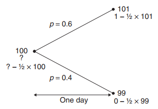
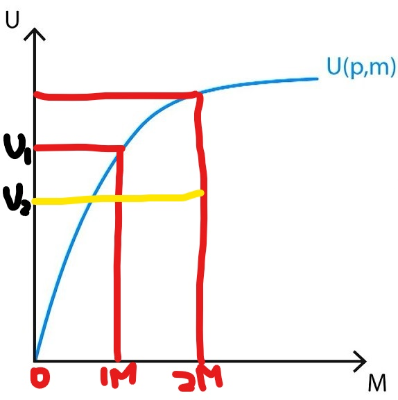

# 1 Introduction
In this chapter we will investigate an unsophisticated way of modelling asset price randomness. However, the crucial concepts of hedging and no arbitrage remains. The binomial model is important, in cases where the value has no closed-form solution (e.g. American options /other custom-made derivatives). The binomial model can be thought of as a numerical method for the solution of the Black-Scholes equation.

# 2 Simple Scenario
Assume now that we have a stock and a call option that expires on the next day. The stock can either rise or fall by a known amount before tomorrow and the interest rates are zero.

Under this scenario, what should be the value of the call option (**It is not 0.6**)?

To answer that, construct a portfolio that long one option and short half a stock:

In either case, the portfolio takes the value $ \frac{99}{2} $ tomorrow. In this case, we have constructed a perfectly risk-free portfolio. As such, the portfolio must be worth the same today (no arbitrage), and the option is worth 0.5.

## 2.1 No Arbitrage
It might be very counter-intuitive that given an expected payout of 0.6 that the option is valued at 0.5. The simple reason is that the 0.6 payout comes with risk (or variance) while the 0.5 payout is perfectly hedged. If there is a sure-win profit (arbitrage) for you, it means that someone else in doing a stupid (i.e. sure lose) trade, and people will rush in to push price to the no arbitrage level (0.5).

Now the question is, why "people will rush in" to correct the arbitrage to 0.5 instead of maximizing expected value and pushing prices to 0.6.

However, to understand this deeply, let's take a look at the utility function:

Imagine you and your friend start with 1 million, and the call option is traded at the so-called fair price of 0.5. As a finance newbie, you valued the option at 0.6 and hence went ahead to buy 2 million options at 0.5. At the same time, your friend, as a smartie, constructed a perfectly hedged portfolio (and hence has 100% absolutely no returns).

As such, your friend's expected utility stays at $ U_1 $. However, for you, your expected utility is now $ U_2 $ because you have a 60% chance of getting 2 million and 40% chance of losing everything.

We can see that for poor people (at the low and steep end of the curve), they have very low risk tolerance (i.e. they utility drops whenever they are below a certain Sharpe ratio). However, for arbitrage, the Sharpe ratio is $ \infty $ and hence everyone can increase their utility this way.

On the other hand, rich people or institutions at the flat end (assume horizontal) of the curve are effectively risk-neutral. They don't really care if they lose 