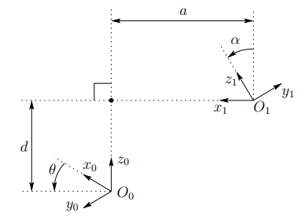

# 1 Coordinate Systems

## 1.1 Coordinates

Let $p \in \mathbb{R}^n$ and $X = \{x^1, &#8230;, x^2\}$ be a complete orthonormal set for $\mathbb{R}^n$, then coordinates of $p$ w.r.t. $X$:

$$p=\sum_{k=1}^n{[p]^n_k}x^k$$

## 1.2 Orthonormal Coordinates

$$ [p]^X_k = p \cdot x^k, 1 \le k \le n \text{ for orthonormal X}$$

## 1.3 Coordinate Transformation

Let $F={f^1,…,f^n}$ and $M={m^1,…,m^n}$ be coordinate frames with $F$ orthonormal coordinate frames in $\mathbb{R}^n$ having the same origin. Let A be defined by $A_{kj} = f^k \cdot m^j$ s.t. $[p]^F = A[p]^M$.

Note that $a^j = [m^j]^F$.

## 1.4 Fundamental Rotations

If mobile coordinate frame $M$ is obtained from fixed coordinate frame $F$ by rotating $M$ about one unit vector of $F$ ➜ transformation is fundamental rotation matrix.

$$ R_1(\phi) = \begin{bmatrix} 1 & 0 & 0 \\\ 0 & \cos\phi & -\sin\phi \\\ 0 & \sin\phi & \cos\phi \end{bmatrix}$$

## 1.5 Composite Rotations

- Initialize $R=I$
- If rotate about $f^k$,$R:=R_k(\theta)R$
- If rotate about $m^k$, $R:=RR_k(\theta)$
- Resulting $R$ maps $M$ to $F$

## 1.6 Homogeneous Coordinates

- Linear operations preserve origin, hence 3D translation not represented in 3&#215;3 matrix
- Let q be a point in $\mathbb{R}^3$, $[q]^F = [q\_1, q\_2, q_3, 1]^T$
- Homogenoues Transformation Matrix $T=\begin{bmatrix} R & p \\\ 0 & 1 \end{bmatrix}$
- Inverse Homogeneous Transformation $T^{-1}=\begin{bmatrix} R^T & -R^Tp \\\ \textbf{0} & 1 \end{bmatrix}$

# 2 Denavit-Hartenberg Representation

## 2.1 Transformation Matrix

$$A\_i = R\_{z, \theta\_i}Trans\_{z,d\_i}Trans\_{x,a\_i}R\_{x,\alpha_i}$$

$$A\_i=\begin{bmatrix} c\_{\theta\_i} & -s\_{\theta\_i} & 0 & 0 \\\ s\_{\theta\_i} & c\_{\theta\_i} & 0 & 0 \\\ 0 & 0 & 1 & 0 \\\ 0 & 0 & 0 & 1\end{bmatrix} \begin{bmatrix} 1 & 0 & 0 & 0 \\\ 0 & 1 & 0 & 0 \\\ 0 & 0 & 1 & d\_i \\\ 0 & 0 & 0 & 1\end{bmatrix} \begin{bmatrix} 1 & 0 & 0 & a\_i \\\ 0 & 1 & 0 & 0 \\\ 0 & 0 & 1 & 0 \\\ 0 & 0 & 0 & 1\end{bmatrix} \begin{bmatrix} 1 & 0 & 0 & 0 \\\ 0 & c\_{\alpha\_i} & -s\_{\alpha\_i} & 0 \\\ 0 & s\_{\alpha\_i} & c\_{\alpha_i} & 0 \\\ 0 & 0 & 0 & 1\end{bmatrix}$$

$$A\_i=\begin{bmatrix} c\_{\theta\_i} & -s\_{\theta\_i}c\_{\alpha\_i} & s\_{\theta\_i}s\_{\alpha\_i} & a\_ic\_{\theta\_i} \\\ s\_{\theta\_i} & c\_{\theta\_i}c\_{\alpha\_i} & -c\_{\theta\_i}s\_{\alpha\_i} & a\_is\_{\theta\_i} \\\ 0 & s\_{\alpha\_i} & c\_{\alpha\_i} & d\_i \\\ 0 & 0 & 0 & 1\end{bmatrix}$$

## 2.2 Link Parameters

- $a\_i, \alpha\_i, d\_i, \theta\_i$ are link length, link twist, link offset and joint angle ($a\_i, \alpha\_i$) always constant, one of $d\_i, \theta\_i$ variable
- $a\_k$ distance from $O\_k$ to intersection of $x^k$ with $z^{k-1}$ or $x^k \times z^{k-1}$ along $x^k$
- $\alpha_k$ is angle of rotation from $z^{k-1}$ to $z^k$ about $x^k$
- $d\_k$ is distance from $O\_{k-1}$ to intersection of $x^k$ with $z^{k-1}$ or $x^k \times z^{k-1}$ along $z^{k-1}$
- $\theta_k$ is angle of rotation from $x^{k-1}$ to $x^k$ about $z^{k-1}$

## 2.3 Existence and Uniqueness ([Proof](https://users.cs.duke.edu/~brd/Teaching/Bio/asmb/current/Papers/chap3-forward-kinematics.pdf))

- An arbitrary homogeneous transformation matrix can be characterized by six numbers, such as, for example, three numbers to specify the fourth column of the matrix and three Euler angles to specify the upper left 3×3 rotation matrix
- However, D-H representation only uses 4 parameters. This is possibe due to the freedom to choose origin and frames
- Required properties
  - The axis $x^1$ is perpendicular to the axis $z^0$
  - The axis $x^1$ intersects the axis $z^0$
  - With these properties, an arbitraty transformation can be represented uniquely by $2\pi$ by $A\_i = R\_{z, \theta\_i}Trans\_{z,d\_i}Trans\_{x,a\_i}R\_{x,\alpha_i}$
